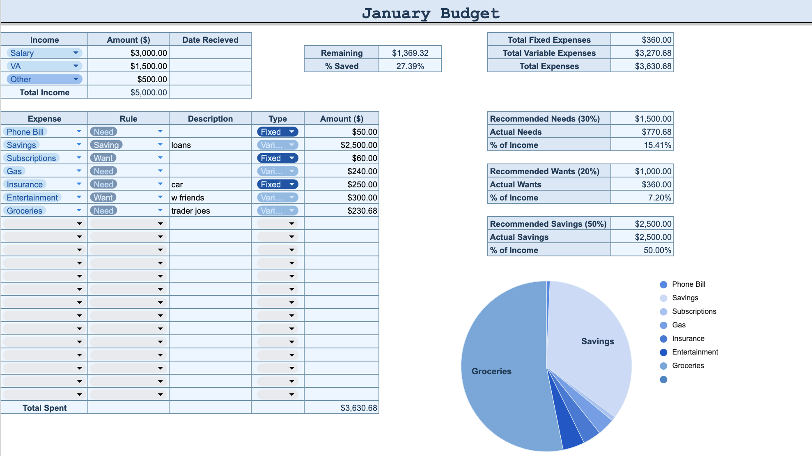

# Budget Tracker Dashboard

## Overview
This project is a multi-sheet budget tracking dashboard built in Google Sheets to manage income, expenses, and savings.

It helps users monitor spending habits, track financial goals, and visualize how money is distributed across categories.

## Features
- Monthly budget tracking across multiple tabs  
- Automated calculations for totals, percentages, and remaining balance  
- Categorized spending (Needs, Wants, Savings)  
- Visual dashboards including pie charts and summary tables  

## Dashboard Preview

## Tools Used
- Google Sheets  
- Spreadsheet formulas and data organization techniques  

## Purpose
The goal of this project was to design a structured, user-friendly system for tracking personal finances, analyzing spending behavior over time, and supporting budgeting.

## Author
Samantha Sandoval  
Computer Science @ California State University San Marcos
